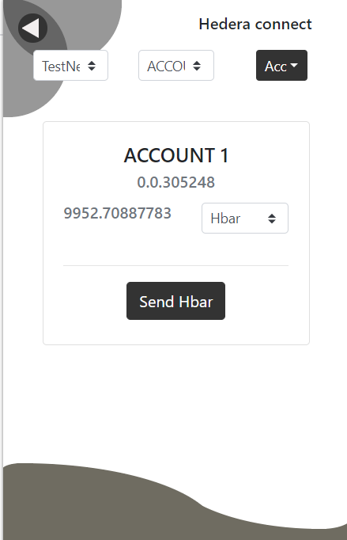

# Hedera Connect

Hedera connet is a browser extension wallet for Hedera Hashgraph. 

The wallet will enable the users to manage hedera accounts in the browser without any other dependency. This can also be used to interact with dApps built on Hedera hashgraph. Using the wallet, users will also be able to create and manage Token built on hedera.

## Idea
The wallet is developed to provide users and developers an easy and user friendly interface to interact with Hedera Hashgraph and dApps built on Hedera.

### Development
This is a [ReactJS](https://reactjs.org/) based Google Chrome Browser Extension.

[Hedera SDK](https://docs.hedera.com/guides/docs/sdks) is used to connect account with Hedera hashgraph using the wallet.

Various Hedera APIs and services which are currently used are:

[Hedera Cryptocurrency Accounts](https://docs.hedera.com/guides/docs/hedera-api/cryptocurrency-accounts), to create, add, and manage Hedera Accounts. \
[Hedera Token Service](https://docs.hedera.com/guides/docs/hedera-api/token-service), for creating and managing tokens in the wallet. \
[Hedera Smart Contracts](https://docs.hedera.com/guides/docs/hedera-api/smart-contracts), for interacting with smart contracts based dApps. \

###### For more details about Hedera Hashgraph goto :  https://docs.hedera.com/guides/

The extension is built using [this](https://github.com/tshaddix/webext-redux-examples/tree/master/clicker-key) boiler-plate code for ReactJS for Chrome extensions.

## Installation

To install the extension run the following commands on your terminal or cmd:

> git clone https://github.com/surajsingla333/hedera_connect \
> cd hedera_connect\
> npm install\
> npm start

Then goto, Google Chrome.\
Write `chrome://extensions/` on the address bar.\
Turn on the developer mode.\
Click on `load unpacked` available on top left.\
Select the `build` folder on the popup window and click ok.

You will see the extension on your browser.

Alternatively, you can download the `build.zip` file from this repository only. Click [here](https://github.com/surajsingla333/hedera_connect/blob/main/build.zip) to download.\
Unzip the downloaded file and follow the above steps in Google Chrome to install the extension.


## Images

        


      


      


   


## Details
Below we have explained about the registration process, usage and security concerns related to the extension. 


### Registration
When a new user start the wallet, he will see a welcome sceen, with a Getting started button. \
On clicking the button, the user will be taken to the registration page. \
User will already have to have a Hedera account which he can create by going on the [official site](https://portal.hedera.com/login). \
After adding the credentials, he will be required to enter a password. This password will be required to login to the wallet and access accounts. This password will also be used to encrypt the keys and hence making a secure system.
After the password is setup, user will be logged in and will be able to use the wallet accordingly.

### Usage
The users can add as many accounts or create a new account in the wallet. The account with which they will register will be treated as the default accounts.\
The users can change between different accounts using a dropdown menu at the top.\
The users will be able to create their own tokens or add an existing tokens to the wallet for token management. \
They can send hbar or tokens to any other users using the account Id of the receiver. 

The wallet sends a `windows.hedera` element at the current webpage, which the users can access in their dApps.\
For example:\
  To access the current account i.e., account currently active in the wallet, the users/developers can use `windows.hedera.account` and they will receive the current accountId and accountName

  Currently available functions in `windows.hedera` are:
  ```python
  windows.hedera.isHedera 
  #returns true if the extension is installed on the browser,

  windows.hedera.account 
  #returns the active accountId object {accountId, accountName} if user is loggedIn to the extension, 
  #else return {}
  ```

### Security
All of the users details will be stored in a secured extension environment only and no data is stored on servers. This will ensure that the data is not exposed online and users will have complete control over their private keys even as they use this extension.\
Users will only have one way to retrieve their account, which is by using the account's private key, so it is adviced to the users to securely store their accounts` private keys.

The private keys are encrypted using the user's password so as to protect the wallet from any offline attacks and the user password itself is securely hashed and only the hashes are matched to confirm the login. \
If the user forgets his password, currently, he won't be able to login and the account will be locked in. So it is highly recommended to securely store the password as well.

